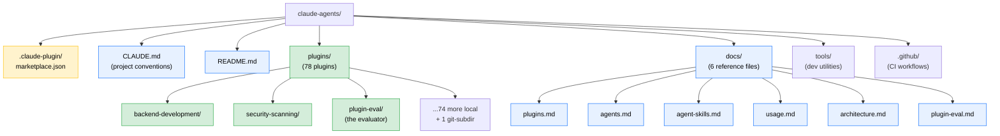
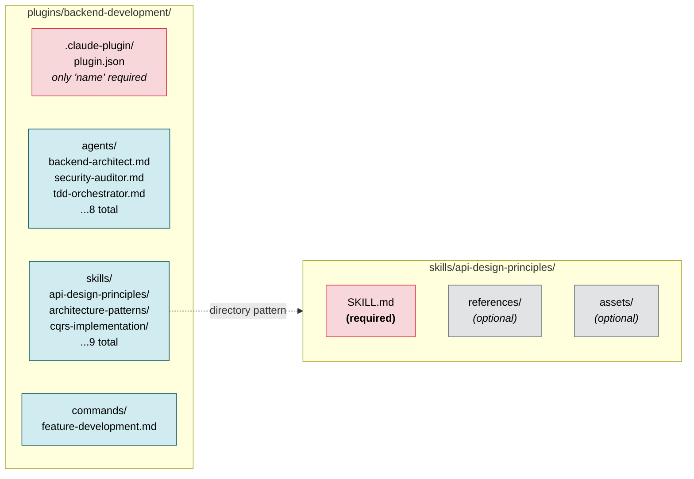
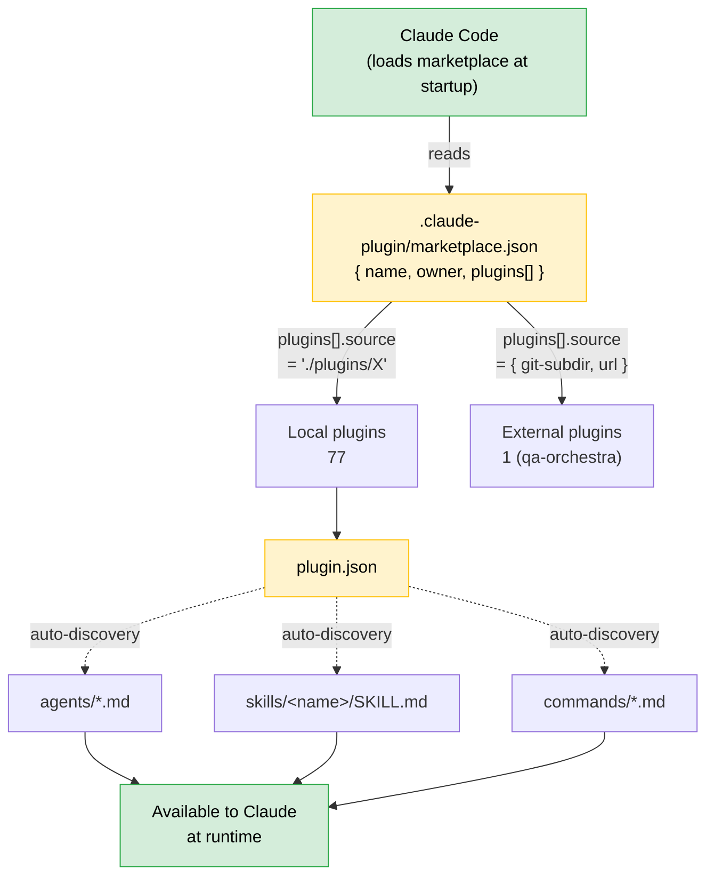
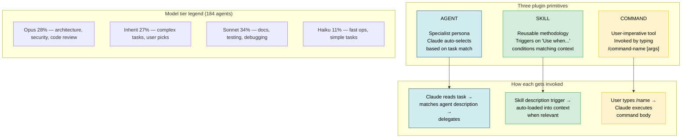
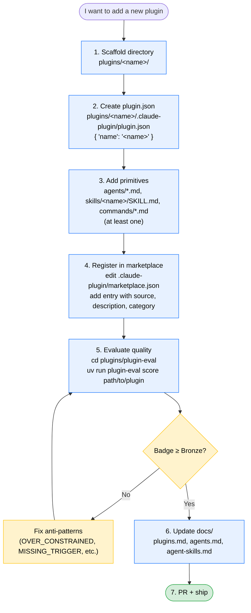
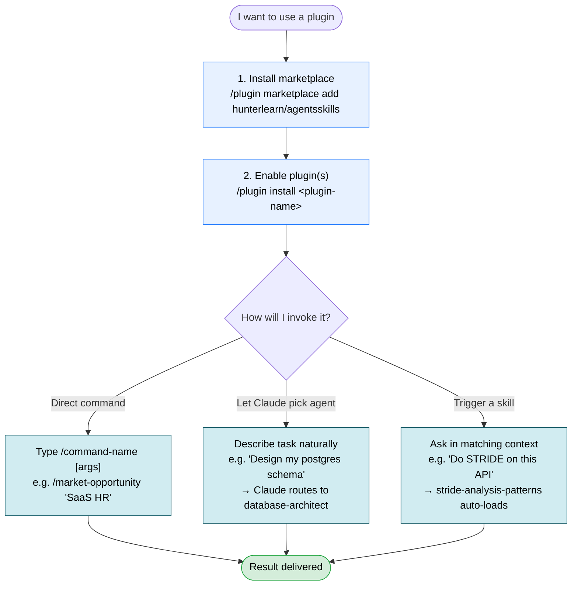
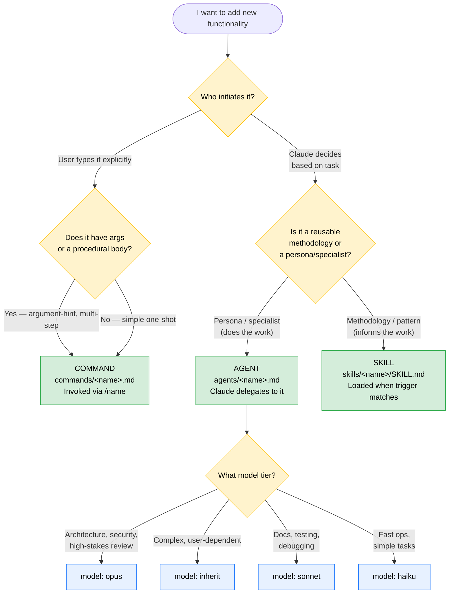

# Visual Overview

A diagram-first tour of this repository — what's here, how the pieces fit, and how to both *contribute* to it and *use* it. Read top to bottom; each section builds on the previous.

> All diagrams are Mermaid and render inline on GitHub. Verified counts at time of writing: **78 plugins** (77 local + 1 external via git-subdir), **184 agents**, **150 skills**, **98 commands**.

---

## 1. Repo map



**Green = you edit it. Yellow = the registry. Blue = reference docs.** Everything contributors author lives under [`plugins/`](../plugins/); the [`.claude-plugin/marketplace.json`](../.claude-plugin/marketplace.json) registers those plugins for Claude Code to discover.

---

## 2. Plugin anatomy



Every plugin has the same shape: a [`plugin.json`](../plugins/backend-development/.claude-plugin/plugin.json) manifest plus any combination of `agents/`, `skills/`, `commands/`. Components are **auto-discovered from the directory structure** — you don't list them in `plugin.json`. Skills are folders (so they can carry `references/` and `assets/`); agents and commands are single `.md` files.

---

## 3. Marketplace wiring



`marketplace.json` is the single source of truth Claude Code reads. Each plugin entry points either at a local directory (`./plugins/X`) or a remote git repo (`source: { source: "git-subdir", url }`). Beyond that, **structure is convention** — no file enumerates the agents/skills/commands; they're picked up by directory layout.

---

## 4. Agent / Skill / Command taxonomy



The three primitives differ in **who triggers them**. Agents are pulled in by Claude when a task description matches their `Use PROACTIVELY when …` clause. Skills auto-load when their `Use when …` trigger sentence matches the surrounding context. Commands run only when the user types `/<name>`. The tier breakdown shows Sonnet is the default workhorse, with Opus reserved for high-stakes specialists.

---

## 5. PluginEval pipeline

```mermaid
sequenceDiagram
    actor User
    participant CLI as plugin-eval CLI<br/>(cli.py)
    participant Parser as parser.py
    participant L1 as Layer 1: Static<br/>(static.py)
    participant L2 as Layer 2: Judge<br/>(judge.py)
    participant L3 as Layer 3: Monte Carlo<br/>(monte_carlo.py)
    participant Claude as Claude API
    participant Engine as engine.py

    User->>CLI: plugin-eval score &lt;path&gt; --depth standard
    CLI->>Parser: parse_skill(path)
    Parser-->>CLI: ParsedSkill
    CLI->>L1: analyze_skill(skill)
    Note over L1: deterministic checks<br/>~2s, free
    L1-->>Engine: LayerResult (score, anti-patterns)
    CLI->>L2: analyze_skill(skill) [async]
    L2->>Claude: 4x rubric prompts<br/>(triggering, orchestration,<br/>output, scope)
    Note over L2,Claude: Haiku + Sonnet<br/>~30s, ~4 calls
    Claude-->>L2: scores
    L2-->>Engine: LayerResult
    opt --depth deep or thorough
        CLI->>L3: analyze_skill(skill) [parallel with L2]
        L3->>Claude: N simulated activations
        Note over L3,Claude: ~2-5min, 50-100 calls
        Claude-->>L3: pass/fail per run
        L3-->>Engine: LayerResult (CI bounds)
    end
    Engine->>Engine: blend layers via<br/>DIMENSION_WEIGHTS
    Engine->>Engine: Badge.from_scores()<br/>Platinum/Gold/Silver/Bronze
    Engine-->>CLI: CompositeResult
    CLI-->>User: markdown / json / html report
```

[`plugins/plugin-eval/`](../plugins/plugin-eval/) is itself a plugin — and the quality gate for every other plugin. Three layers run in sequence (Static is always-on; Judge runs at `standard`+; Monte Carlo only at `deep`/`thorough`). Each layer emits a `LayerResult` which [`engine.py`](../plugins/plugin-eval/src/plugin_eval/engine.py) blends into a composite score using per-dimension weights, then [`models.py`](../plugins/plugin-eval/src/plugin_eval/models.py) assigns a badge.

### Scoring dimensions and badges (reference)

| Dimension | Weight | | Badge | Min composite | Min Elo |
|---|---|---|---|---|---|
| triggering_accuracy | 25% | | Platinum | ≥ 90 | ≥ 1600 |
| orchestration_fitness | 20% | | Gold | ≥ 80 | ≥ 1500 |
| output_quality | 15% | | Silver | ≥ 70 | ≥ 1400 |
| scope_calibration | 12% | | Bronze | ≥ 60 | ≥ 1300 |
| progressive_disclosure | 10% | | | | |
| token_efficiency | 6% | | | | |
| robustness | 5% | | | | |
| structural_completeness | 3% | | | | |
| code_template_quality | 2% | | | | |
| ecosystem_coherence | 2% | | | | |

Anti-patterns (caught by Layer 1 in [`static.py`](../plugins/plugin-eval/src/plugin_eval/layers/static.py)): `OVER_CONSTRAINED` (>15 MUST/ALWAYS/NEVER), `EMPTY_DESCRIPTION` (<20 chars), `MISSING_TRIGGER` (no "Use when…"), `BLOATED_SKILL` (>800 lines, no `references/`), `ORPHAN_REFERENCE`, `DEAD_CROSS_REF`.

---

## 6. Authoring lifecycle — adding a new plugin



Steps 1–3 are pure file scaffolding under [`plugins/<name>/`](../plugins/). Step 4 — registering in [`.claude-plugin/marketplace.json`](../.claude-plugin/marketplace.json) — is the moment the plugin becomes installable. Step 5 is the quality gate: PluginEval will fail the loop until anti-patterns are gone and the composite score crosses Bronze.

---

## 7. Consumer lifecycle — using a plugin



After installing the marketplace and enabling one or more plugins, you have three distinct ways to invoke functionality. Commands are imperative (you type them). Agents are delegational (Claude routes to them based on how you describe the task). Skills are contextual (they load automatically when the surrounding conversation matches their trigger). See [`docs/usage.md`](usage.md) for a deeper walkthrough.

---

## 8. Decision guide — agent, skill, or command?



Use this when scoping a new contribution. The first split is *who triggers it*: if the user has to type it, it's a command. If Claude picks it, the second split is *what kind of thing it is*: a doer is an agent; a how-to is a skill. Agents additionally pick a model tier matching the stakes of the task.

---

## Where to go next

Read in this order to build mental model fast:

1. [**`docs/architecture.md`**](architecture.md) — design philosophy and *why* the primitives are split this way.
2. [**`docs/usage.md`**](usage.md) — concrete examples of invoking plugins as a consumer.
3. [**`docs/plugin-eval.md`**](plugin-eval.md) — full PluginEval framework details (rubrics, Elo, anti-patterns).
4. [**`docs/plugins.md`**](plugins.md) — catalog of all 78 plugins to browse what already exists before authoring something new.
5. [**`docs/agents.md`**](agents.md) and [**`docs/agent-skills.md`**](agent-skills.md) — reference indexes when you need a specific capability.
